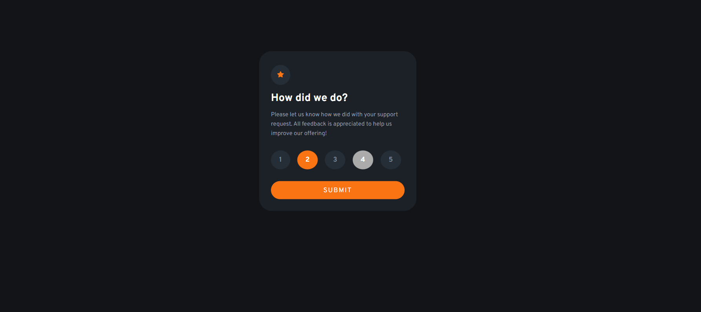
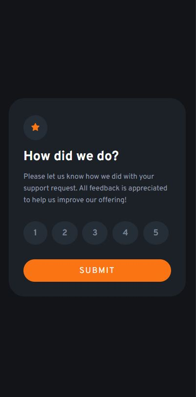
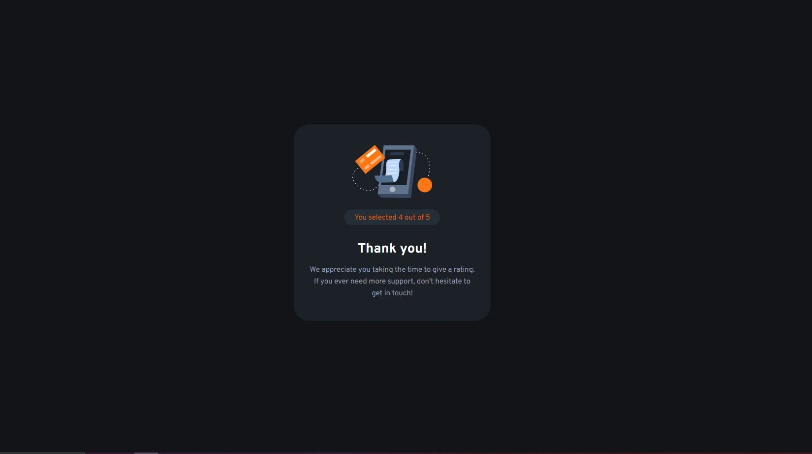
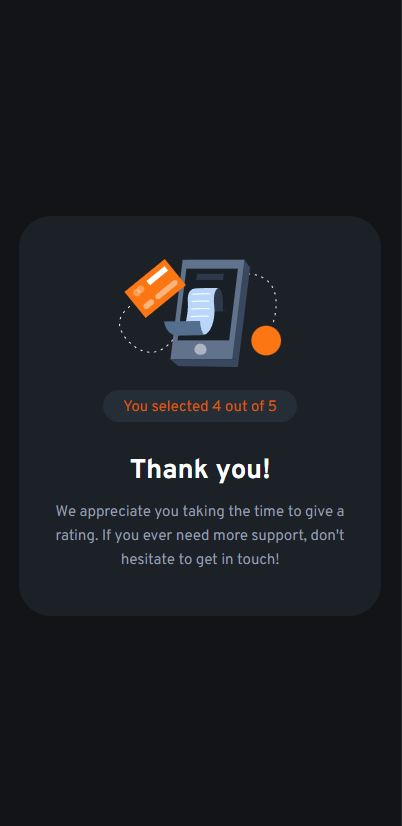

# Frontend Mentor - Interactive rating component solution

This is a solution to the [Interactive rating component challenge on Frontend Mentor](https://www.frontendmentor.io/challenges/interactive-rating-component-koxpeBUmI). Frontend Mentor challenges help you improve your coding skills by building realistic projects

## Table of contents

- [Overview](#overview)
  - [Screenshot](#screenshot)
  - [Links](#links)
- [My process](#my-process)
  - [Built with](#built-with)
  - [What I learned](#what-i-learned)
- [Author](#author)


## Overview

### Screenshot






### Links
- Solution URL: [https://github.com/pazza0118/ratingComponent.git]
- Live Site URL: [https://pazza0118.github.io/ratingComponent/]

## My process
- Identified and figured out the method for executing the individual steps needed for selecting and submitting a rating
  - identify html element for selecting a score
  - figure out how to send data from html to js file
  - figure out how to get data from one js file to another js file
- Coded in the order of html -> js -> css

### Built with
- Semantic HTML5 markup
- CSS custom properties
- Flexbox
- CSS Grid

### What I learned
```js
document.querySelector('input[name="rating"]:checked').value

el.addEventListener("click", e => {

localStorage.setItem('rating', rating)

window.location.href = './thankyou_card.html'

```

## Author
- Website - [Young Hun Lee](https://www.your-site.com)
- Frontend Mentor - [@pazza0118](https://www.frontendmentor.io/profile/pazza0118)